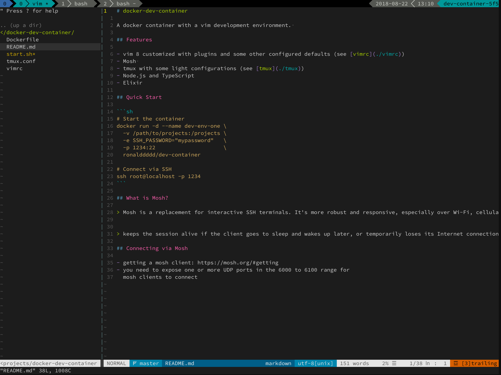

# docker-dev-container

A containerized development environment. 

## Features

- zsh (OhMyZsh)
- git
- fzf with keybindings
  - `alt c` for fuzzy directory search + cd
  - `ctrl t` for fuzzy file path search + paste
  - `ctrl r` for fuzzy history search
- vim 8 customized with plugins and some other configured defaults (see [vimrc](./vimrc))
  - `ctrl o` File Browser (NERDTree)
  - `ctrl p` File quick open (ctrlp)
  - `ctrl n` Multi-cursor (vim-multiple-cursors)
  - Auto-format (vim-prettier)
  - ~~Auto-complete (YouCompleteMe)~~
  - Syntax checking (syntastic)
- Mosh - mobile shell eliminates ssh disconnects over unstable networks
- tmux with some light configurations (see [tmux](./tmux.conf))
- doctl -- DigitalOcean's CLI tool
- node.js and yarn

## Quick Start

### Connecting via docker-compose

- mounts `${WORKSPACE_DIR}`, defaults to `./workspace`
- mounts (read-only) `${SSH_DIR}`, defaults to `~/.ssh` 

```shell
docker-compose up -d
docker-compose exec workspace zsh
```

### Connecting via SSH

```shell script
# Start the container
docker run -d -e SSH_PASSWORD="supersecret" -p 2233:22 ronalddddd/dev-container

# Shell into it
ssh root@localhost -p 2233
```

### Connecting via Mosh

```shell script
mosh root@localhost -p 6000 --ssh="ssh -p 1234"
```

## Advanced Usages
- SSH into it using your private key by setting the environment variable `DEVELOPER_PUBLIC_KEY` 
- Mount a project folder to `/projects` (so you don't lose your work :)
- Mount a `.ssh` folder with required credentials
  - `authorized_keys` file for logging in
  - Private keys for accessing  remote repositories, etc... 
- Expose SSH port
- Expose Mosh port range (UDP 6000 to 6100)

## What is Mosh?

> Mosh is a replacement for interactive SSH terminals. It's more robust and responsive, especially over Wi-Fi, cellular, and long-distance links.


> keeps the session alive if the client goes to sleep and wakes up later, or temporarily loses its Internet connection

- getting a mosh client: https://mosh.org/#getting
- you need to expose one or more UDP ports in the 6000 to 6100 range for
  mosh clients to connect

## Screenshots

### Vim


